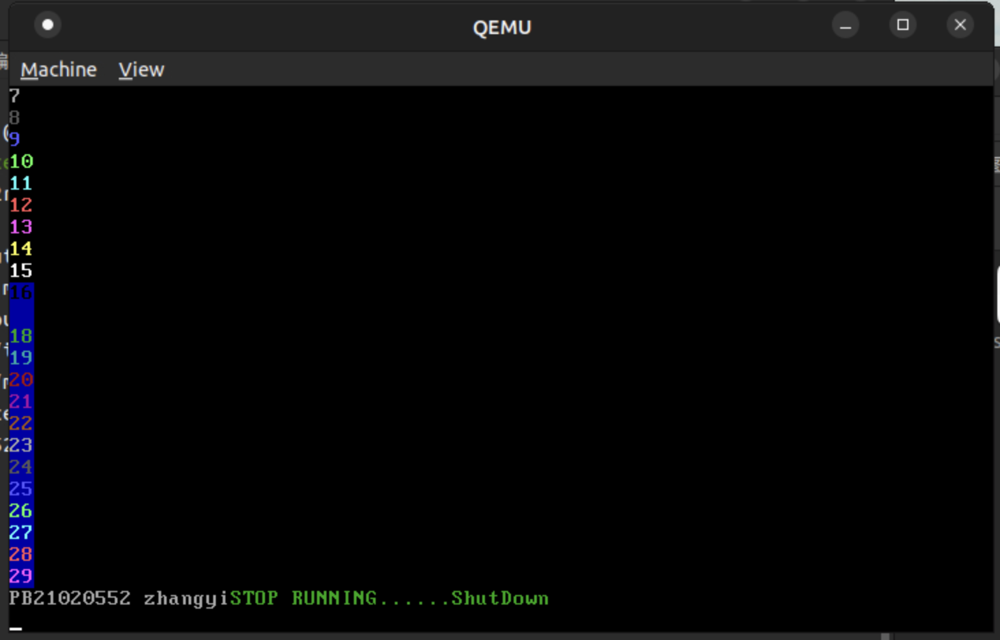

# lab2
PB21020552 张易

## 原理说明
### 软件框图及其概述
软件框图如下,且是自下而上.


结构分为:
1. I/O端口,通过少量的汇编完成.
2. UART和VGA输出模块,基于I/O端口与写入的VGA显存控制.
3. 格式化输出模块,包含myPrintk,myprintf以及vsprintf.
4. 用户模块USERAPP,可以自由调用其下的函数.

### 主流程以及其实现代码
#### 主流程
1. 从multibootHeader.S的start开始,引导系统的装载.
2. 通过call_start到start32.S,完成堆栈的处理,同时初始化bss
3. 用call os跳转到 osStart.c开始运行系统,内核输出系统运行提示字符.
4. osstart.c调用mymain()开始运行用户程序.
5. 然后返回osStart.c,用while(1)死循环停机.

### 主要功能模块及其实现
- **Muliboot Header**
直接利用助教提供的代码.
```s
.globl start

MAGIC = 0x1BADB002 # we use version 0.6.96 not version 2 (magic = 0xe85250d6)
FLAGS = 0
CHECKSUM = 0xE4524FFE   #(magic + checksum + flags should equal 0)

.section ".multiboot_header"
.align 4
  .long MAGIC
  .long FLAGS
  .long CHECKSUM

.text
.code32
start:
  call _start
  hlt  
```
- **I/O端口**
  - **inb**
    ```cpp
    unsigned char inb(unsigned short int port_from){
    unsigned char value;
    __asm__ __volatile__ ("inb %w1, %b0": "=a"(value): "Nd"(port_from));
    return value;
    }
    ```
    通过c语言内嵌汇编实现.
    其中%w1表示读取的第二个变量,w表示字节数16,N表示立即数,d表示先对于%edx进行存入,在作为本条指令的操作数.
    %b0为读取内容的存放处,0代表第一个变量(value),b表示长度8,=a表示先读入寄存器%eax
- **outb**
  ```c
  void outb (unsigned short int port_to, unsigned char value){
    __asm__ __volatile__ ("outb %b0,%w1"::"a" (value),"Nd" (port_to));
  } 
  ```
  原理同inb.
- uart输出
通过调用inb以及outb进行输出
  - uart_base定义
  ```c
  #define uart_base 0x3F8
  ```
  - 得到字符
  ```c
  void uart_put_char(unsigned char c){
	outb(uart_base,c);
  }
  ```
  - 输出字符
  ```c
  void uart_put_char(unsigned char c){
	outb(uart_base,c);
  }
  ```
  - 输出字符串
  ```c
  void uart_put_chars(char *str){ 
	//填写正确的内容    
	while(*str!='\0')
	{
		outb(uart_base,*str);
		str+=1;
	}
  }
  ```

### VGA输出
- VGA光标设置
```c
void update_cursor(void){//通过当前行值cur_cline与列值cur_column回写光标
	//通过其上下8bit数据对齐完成更新,同时可以发现其偏移量为
	unsigned int k_loc;
	k_loc = cur_line * 80 + cur_column;
	unsigned int low,high;
	low = k_loc & 0x000000ff;
	high = (k_loc>>8)&0x000000ff;
	outb(0x3D4,0x0F);
	outb(0x3D5,low);
	outb(0x3D4,0x0E);
	outb(0x3D5,high);
}
```
k_loc表示一维偏移量,high定义为高八位,通过移位再使用交操作得到,low定义为低八位.通过不同的索引接口,对分别写入高八位与低八位.
- 得到光标的位置
```c
short get_cursor_position(void){//获得当前光标，计算出cur_line和cur_column的值
	//填写正确的内容    
	unsigned short low,high;
	unsigned short location;
	outb(0x3D4,0x0f);
	low=inb(0x3d5);
	outb(0x3D4,0x0E);
	high=inb(0x3d5);
	location=low+(high<<8);
	cur_column = location %80;
	cur_line = (location-cur_column)/80;
}

```
操作同理,反过来完成即可.
- 清屏操作
```c
void clear_screen(void) {
	unsigned short *clean_srceen = (short *)vga_init_p;
	int i;
	for(i=0;i<25*80*2;i++){
		*clean_srceen = 0x0f20;
		clean_srceen += 1;
	}

	cur_column=0;
	cur_line=0;
	update_cursor();
}
```
判断出vga共有25\*80个字符,同时一个字符占位16字节,char类型共占用16个字节,也就是只要对于25*80个short长度完成赋值空格,同时选取背景为x0f.即可
- 滚屏操作
```c
void scroll_func(void){
	unsigned short *srcoll = (short*) vga_init_p;
	int i=0,j=0;
		for(j=0;j<24;j++){
			for(i=0;i<80;i++)//拷贝80个字符
			{
				*(srcoll+80 * j+i) = * (srcoll +80+80*j +i);
			}
		}
		for(i=0;i<80;i++){
			*(srcoll + 80*j +i) = 0x0f20;
		}
		cur_column = 0;
		cur_line = 24;
		update_cursor();
}
```
滚屏是建立在vga只能输出25*80个字符,所以在字符行数到达24是,i行拷贝i+1行,同时清空25行,最后更新光标即可.为了方便期间,采用short来拷贝字符.
- 单个字符写入
```c
void append_word(unsigned char c,int color){
	//通过以上函数,可以通过行列来更新光标,也可以通过函数来获得光标位置.
	//这里采用的是通过行列指标来回写一维偏移量.
	//这里的写法开始是有点错误的,由于这里的字符占位16位,而char的数量是8位,所以会把数字写在错误的位置上
	unsigned char *append_input;
	append_input = vga_init_p + (80 * cur_line +cur_column)*2;
	* append_input = c;
	append_input ++;
	*append_input = color;
	if(cur_column == 79){
		cur_column = 0;
		cur_line++;
	}
	else cur_column = cur_column+1;
	//从这里开始完成,如果下一个输入越界，则完成滚屏操作。
	if(cur_line==25) scroll_func();

	//以上完成正常的光标位置更新
	update_cursor();
}
```
以上写入单个字符,同时判断滚屏(到达26行),同时判断是否到达下一行,cur_line++,cur_column=0.同时利用char分别放置字体与字符.
- 完整字符处理.
```c
void append2screen(char *str,int color){ 
	//填写正确的内容    
	int i;
	for(i=0;str[i]!='\0';i++){
		switch (str[i])
		{
		case'\n' :
			if(cur_line==24) scroll_func();
			else{
			cur_column=0;
			cur_line=cur_line+1;
			update_cursor();
			}
			break;	
		case'\r':
			cur_column = 0;
			update_cursor();
			break;
		case'\f':
			clear_screen();
			break;
		case'\b':
			if(cur_column!=0){
				if(cur_line!=0) {cur_line--;update_cursor();}
			}
			break;

		default:
			append_word(str[i],color);
			break;
		}
	}
}
```
同时对于'\n'的操作,如果在第25行上,那么进行滚屏,如果不在25行上,行数加一,列数清0.其他转移字符讨论类似.
## 源代码说明
- 目录组织
```c
src
|_____multibootheader
|     |_____multibootHeader.S //multiboot启动
|_____myOS
|     |_____dev
|     |     |_____uart.c //串口输出
|     |     |_____vga.c //vga输出
|     |_____i386
|     |     |_____io.c //I/O端口
|     |     |_____io.h
|     |_____printk
|     |     |_____myPrintk.c //格式化输出
|     |     |_____vsprintf.c
|     |_____osStart.c //系统启动程序
|     |_____start32.S //数据段、bss段、堆栈空间分配
|_____userApp
      |_____main.c //用户程序}
```
- makefile 组织
```c
src
|_____myOS
|     |_____dev
|     |_____i386
|     |_____printk
|_____userApp
```
- 格式化处理模块
```c
  char kBuf[400];
  int myPrintk(int color, const char *format, ...) {
      int i;
      va_list args;
      
      va_start(args, format);
      i = vsprintf(kBuf, format, args);
      va_end(args);
      append2screen(kBuf, color);
      uart_put_chars(kBuf);
      
      return i;
  }
```
用可变参数内容,用vsprintf将vsprintf把字符格式化处理,然后存在缓冲区kBuf,然后用VGA和UART输出.
对于myPrintf,把kBuf换成uBuf.
## 编译内容说明
```makefile
MULTI_BOOT_HEADER=output/multibootheader/multibootHeader.o
include $(SRC_RT)/myOS/Makefile
include $(SRC_RT)/userApp/Makefile

OS_OBJS       = ${MYOS_OBJS} ${USER_APP_OBJS}

output/myOS.elf: ${OS_OBJS} ${MULTI_BOOT_HEADER}
	${CROSS_COMPILE}ld -n -T myOS/myOS.ld ${MULTI_BOOT_HEADER} ${OS_OBJS} -o output/myOS.elf

output/%.o : %.S
	@mkdir -p $(dir $@)
	@${CROSS_COMPILE}gcc ${ASM_FLAGS} -c -o $@ $<

output/%.o : %.c
	@mkdir -p $(dir $@)
	@${CROSS_COMPILE}gcc ${C_FLAGS} -c -o $@ $<

clean:
	rm -rf output
```
1. 编译.s源文件与c语言.c源文件,生成.o同时包括了其他目录下的makefile文件.
2. 链接.o文件生成myolf.elf文件,可以通过qemu命令直接使用.
## 代码布局说明
```livescript
OUTPUT_FORMAT("elf32-i386", "elf32-i386", "elf32-i386")
OUTPUT_ARCH(i386)
ENTRY(start)

SECTIONS {
	. = 1M;
	.text : {
	    *(.multiboot_header) 
		. = ALIGN(8);
		*(.text)
	}
	
	. = ALIGN(16);
	.data		: { *(.data*) }
	
	. = ALIGN(16);
	.bss		:
	{
		__bss_start = .;
		_bss_start = .;
		*(.bss)
		__bss_end = .;
	}
	. = ALIGN(16);
	_end = .;
	. = ALIGN(512);	
}
```
1M表示text段起始偏移为1M,其下每一个段均为ALIGN(16),表示起始地址均是
## 运行和运行结果说明
通过脚本运行
脚本内容
```sh
SRC_RT=$(shell pwd)
echo $SRC_RT

make clean

make

if [ $? -ne 0 ]; then
	echo "make failed"
else
	echo "make succeed"
	qemu-system-i386 -kernel output/myOS.elf -serial stdio
fi
```
在终端下src目录中输入
```sh
./source2run.sh
```
调整mymain()内容输出为:



vga输出通过函数
```c
myPrintf(0x7,"PB21020552 zhangyi");
```
uart输出通过函数
```c
art_put_chars("PB21020552 zhangyi");
```
可以发现,输出符合预期内容.
## 遇到的问题
- 混淆了滚屏与清屏
- 未能理解uart的输出调用方式,发现是要改动,mymain()对于uart进行
