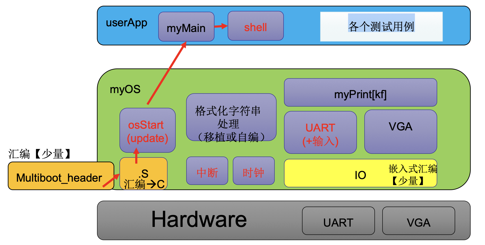
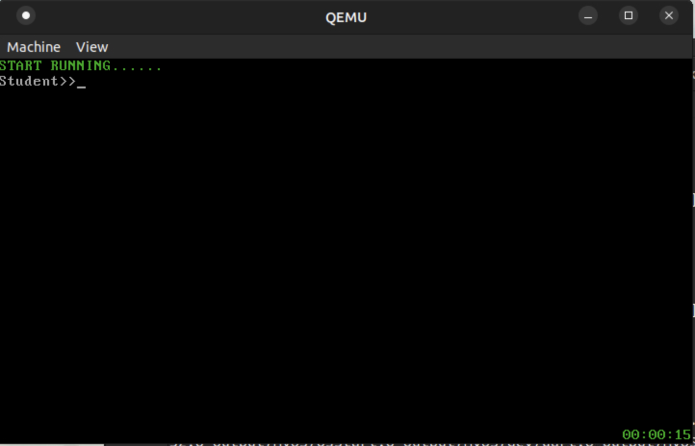
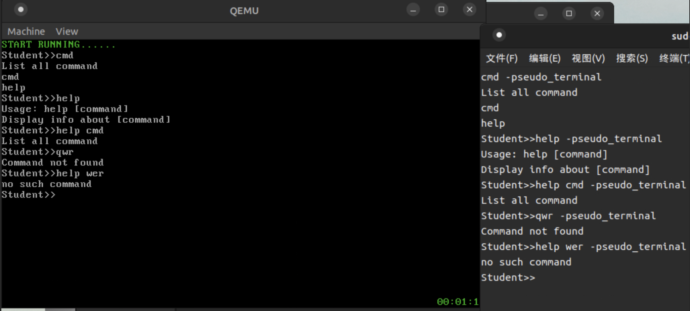

# 实验3 shell&interrupt&timer

## 原理说明

### 软件框图如下:



### 概述

1. 最底层的是现实I/O,通过内嵌汇编完成,实现对于硬件的输入输出,然后通过I/O实现UART以及VGA输出程序,以及I8259和i8253的初始化处理.
2. 通过i8259以及i8253实现时钟中断TICK,同时设置了中断向量表的初始化,以及把除了时间中断以外都设置成了ignore_int.同时利用tick机制设置了墙钟机制.
3. 在shell模块实现简易的shell模块

### 主流程说明

1. 启动:从multibootHeader.s开始,完成multibootheader的引导,然后跳转至start32.s,还是初始化bss段以及初始化idt(全部填入ignore_int),同时填入tick中断.
2. 转入osStart函数,开始逐步完成i8253,i8259A芯片,再打开了enable_interrupt函数,表示开中断,进行清屏操作.然后开始执行mymian,在其中调用了startshell,也就是shell模块
3. 通过已经实现的vsprintf函数(助教给出)实现墙钟的输出,以及通过tick内部设置systemtick计算时间,以及时间的初始化.

## 主要功能模块以及其实现

### 中断机制以及其初始化
- 中断描述符表以及其初始化

    - 为IDT分配一块内存

    ```x86asm
     .data
    # IDT
    	.p2align 4
    	.globl IDT
    IDT:
    	.rept 256
    	.word 0,0,0,0
    	.endr
    idtptr:

    	.word (256*8 - 1)
	    .long IDT
    ```
    以上每一个中断向量长度为64位,共有256位长.
    - 对于所有中断处理程序初始化为缺省

    ```x86asm
    setup_idt:
    	movl $ignore_int1,%edx # ignore应该是一个32位的地址
    	movl $0x00080000,%eax # edx应该是作为高位的数据,地址在向上生长.
    	movw %dx,%ax /* selector = 0x0010 = cs */
    	movw $0x8E00,%dx /* interrupt gate - dpl=0, present */
    	movl $IDT,%edi
    	mov $256,%ecx
    	
    rp_sidt:
    	movl %eax,(%edi) //代表了中断向量表的位置,eax应该指的是时钟调用的中断在向量表的第一条
    	movl %edx,4(%edi) //这个代表了,没有这个服务,会去调用no such 指令
    	addl $8,%edi
    	dec %ecx
    	jne rp_sidt
    	// 应该是,中断向量表每一条指令有64位,上述操作每次存储了一条指令.然后上完成了终端向量表
    	// ignore_body的初始化.
    ```
    其中解释如注释.

    - 设置时间中断
    ```x86asm
    setup_time_int_32:
    	movl $time_interrupt,%edx
    	movl $0x00080000,%eax /* selector：0x0010 = cs */
    	movw %dx,%ax
    	movw $0x8E00,%dx /* interrupt gate - dpl=0, present */
    	movl $IDT,%edi
    	addl $(32*8), %edi
    	movl %eax,(%edi)
    	movl %edx,4(%edi)
    	ret
    ```
    以上在指定位置表项32填入时间中断程序的位置之后可以通过idtptr调用.
- 寄存器IDTR的初始化
    - 内存分配如上所示.
    - 初始化通过以下代码完成

    ```x86asm
    lidt idtptr
    ```
- 开关中断函数设置
    ```x86asm
    enable_interrupt:
    //你需要填写它
    	sti
    	ret
    	.globl disable_interrupt
    disable_interrupt:
    //你需要填写它
    	cli
    	ret
    ```
    分别是sti与cli指令.

### 可编程中断控制器以及其初始化
- i8253
```c
void init8253(void){
	//你需要填写它
	unsigned int fre_div=1193180/100;//定义需要完成计数的值
	outb(0x43,0x34);//高低字节均需要完成相关操作
	unsigned char low,high;
	low = fre_div;
	high = fre_div >>8;
	outb(0x40,low);
	outb(0x40,high);
	outb(0x21,inb(0x21)&0xFE);//如果完成了计算,发出中断.
}
```
从实验文档处得知,时钟中断频率为1193180,为了实现分频100HZ,所以必须引入分频机制,也即是fre_div,通过两个端口输入设置计数器,每一次到达这个数字,发送一次中断信号,同时最后一行实现了读取原来的屏蔽字,将最低位置零.
- i8259
```c
void init8259A(void){
	//你需要填写它
	//屏蔽所有中断源
	outb(0x21,0xff);
	outb(0xA1,0xFF);
	//主片初始化
    outb(0x20, 0x11);
    outb(0x21, 0x20);
    outb(0x21, 0x04);
    outb(0x21, 0x3);
	//从片初始化
    outb(0xA0, 0x11);
    outb(0xA1, 0x28);
    outb(0xA1, 0x02);
    outb(0xA1, 0x01);

}
```
依照实验文档建议,以上依次完成了屏蔽所有的中断源,同时完成初始化主片与从片,并完成初始化向量号,接入引脚位,并且设置中断结束标志.

### tick与墙钟设置

上方的芯片100Hz的频率调用tick函数,tick函数通过了一个全局变量system_ticks,设置时分秒.
同时在tick中设置了三个函数模块
- setWallClock() 
该函数用以显示时分秒
  ```c
  void setWallClock(int HH,int MM,int SS){
  	//你需要填写它
  	// 这里进行时钟单纯的输出.同时末尾必须输出\n表示换行
  	int i;
  	char vga_print[9];
  	vga_print[0]='0'+HH/10;
  	vga_print[1]='0'+HH%10;
  	vga_print[2]=':';
  	vga_print[3]='0'+MM/10;
  	vga_print[4]='0'+MM%10;
  	vga_print[5]=':';
  	vga_print[6]='0'+SS/10;
  	vga_print[7]='0'+SS%10;
  	long offest = (80*25-8)*2;
  	char *p = (char *)(VGA_BASE+offest);
  	for(i=0;i<8;i++){
  		*p = vga_print[i];
  		*(p+1) = 0x2;
  		p=p+2;
  	}
  }
  ```
- getWallClock()
该函数用以得到在vga固定位置的已有的时分秒,同时对于时分秒在最初完成初始化,也就是最初如果显示有效即正常显示,否则显示对应的初始化位置,同时每次超出初始化位置,完成归零.
  ```c
  void getWallClock(int *HH,int *MM,int *SS){
  	//你需要填写它
  	//HH,MM,SS 从特定的VGA位置得到这个,然后对于全局的HH,MM.SS进行写入.
  	long offest = (80*25-8)*2;
  	char *p = (char *)(VGA_BASE+offest);
  	*HH = (*p - '0')*10+(*(p+2)-'0');
  	p=p+6;
  	*MM = (*p - '0')*10+(*(p+2)-'0');
  	p=p+6;
  	*SS = (*p - '0')*10+(*(p+2)-'0');
  	if(*HH>23 || *HH<0) *HH = 0;
  	if(*MM>59 || *MM<0) *MM =0;
  	if(*SS>59 || *SS<0) *SS = 0;
  }
  ```
- tick() 主函数
可以看出tick通过维护system_tick来设置时分秒.
```c
void tick(void){
	int *H_ptr,*M_ptr,*S_ptr;
	H_ptr = &HH;
	M_ptr =&MM;
	S_ptr = &SS;
	getWallClock(H_ptr,M_ptr,S_ptr);//这里应该是拿到当前的时钟,但是还没对于其进行操作
	system_ticks++;
	if(system_ticks==100) {
		system_ticks =0;
		if(SS!=59){
			SS++;
		}
		else {
			SS=0;
			if(MM!=59)
			{
				MM++;
			}
			else{
				MM=0;
				if(HH!=23){
					HH++;
				}
				else{
					HH=0;
				}
			}
		}
	}
	//你需要填写它
	setWallClock(HH,MM,SS);
	return;
}
```
### shell设置
在此shell需要实现两个函数也就是cmd以及help函数,其功能分别(cmd)是显示所有的命令,(help)显示对应功能的用途,这里由于助教提供的sprintf不能实现%s的处理,所以打印功能分别通过直接输出.
- **命令功能实现**
  - cmd
    ```c
    int func_cmd(int argc, char (*argv)[8]){//这个是对应的func_cmd函数对应的操作
        myPrintk(0x7,"List all command\n\0");
        myPrintk(0x07,"cmd\n");
        myPrintk(0x07,"help\n");// 输出所有的命令名.
        return 1;
    } 
    ```
  - help
    ```c
    int func_help(int argc, char (*argv)[8]){
        // help 调用指定命令的help函数,没有指定函数,则调用help的help函数.
        if (argc==1){//表示只有一个参数,也就是直接调用help的help
            myPrintk(0x7,"Usage: help [command]\nDisplay info about [command]\n\0\n");
            return 0;
        }
        else if(argc>2) {
            myPrintk(0x7,"no such command\n");
            return 1;
        }
        else if(mystrcmp("cmd",argv[1])==0) {//需要去对于指定函数的相关名称完成比较.同时是需要对于argv[1]也就是第二个数组完成相关的比较
            myPrintk(0x7,"List all command\n\0");
            return 0;
        }
        else if(mystrcmp(help.name,argv[1])==0){
            myPrintk(0x7,"Usage: help [command]\nDisplay info about [command]\n");
            return 0;
        }
        else{
            myPrintk(0x7,"no such command\n");
            return 1;        
        }
    }
    ```
    有关help的处理比较复杂,必须通过传入数组数量来衡量help功能,同时如果传入参数为两位,必须比较后两位与cmd以及help的字符串(mystcmp).
- startShell()
    - 数组读入与处理
      ```c
      BUF_len = 0;
      while((BUF[BUF_len]=uart_get_char())!='\r'){
          uart_put_char(BUF[BUF_len]);//将串口输入的数存入BUF数组中
          BUF_len++;  //BUF数组的长度加                      
      }
       while(BUF[i]!='\r'){//注意BUF是以回车的字符结尾的,同时这里采用用空格分割每一个函数名称的方式.
              if(BUF[i]!=' '&&j!=8){
                  argv[argc][j]=BUF[i];
                  i++;
                  j++;
              }//以上正常的读入
              else if(j==8)//表示字符串溢出
              {   
                  argc++;
                  j = 0;//重置为0
              }
              else if(BUF[i]==' '){//表示在一个读入的过程中遭遇分隔,还是没有输入满8个字符,所以需要完成
                  argv[argc][j+1]='\0';//在末尾放置0
                  argc++;
                  j=0;
                  i++;
              }
      }
      if(j!=8){
          argv[argc][j]='\0';
      }//在末尾放置\0字符,同时对于argc++
      argc++;//表示存入了多少个,buf传入了多少参数.
      ```
    从助教给出的BUF的读入,该字符串以'\r'结尾,同时我们需要把其处理成argv[8][8]的形式,也就是二维数组,同时采用空格作为分隔符.所以该字符串必须考虑两种切割模式,一种以空格结尾,另一种是以填满结尾.同时为了mystrcmp比较的方便需要对于未填满的字符串末尾放置'\0'.同时结尾对于argc进行自增操作,表示填入了多少个字符串.
    - 确定shell功能,对于首个字符串,测量其值,完成各自功能的建立
      ```c
          if(mystrcmp("cmd",argv[0])==0){cmd.func(argc,argv);}
          else if(mystrcmp(help.name,argv[0])==0){help.func(argc,argv);}
          else myPrintk(0x7,"Command not found\n");
      ```

## 目录组织

- 代码组织

    

    

- makefile组织

    ```
    src
    ├── myOS
    │   ├── dev
    │   ├── i386
    │   ├── kernel
    │   ├── printk
    └── userApp
    ```

## 代码布局说明

| Offset | field |  Note | 
| ---------------- | -------------- | -----|
| 1M                   | .text              | 代码段   |
| ALIGN(16)           | .data              | 数据段   |
| ALIGN(16)           | .bss             | bss段，存储未初始化的变量   |
| ALIGN(16)           |               | _end 堆栈起始地址 |
其代码布局同lab2中的代码布局一致.

## 编译说明
makefile文件如下:
  ```makefile
  SRC_RT=$(shell pwd)

  # CROSS_COMPILE=i686-elf-
  CROSS_COMPILE=
  ASM_FLAGS= -m32 --pipe -Wall -fasm -g -O1 -fno-stack-protector	
  C_FLAGS =  -m32 -fno-stack-protector -g
  INCLUDE_PATH = myOS/include

  .PHONY: all
  all: output/myOS.elf

  MULTI_BOOT_HEADER=output/multibootheader/multibootHeader.o
  include $(SRC_RT)/myOS/Makefile
  include $(SRC_RT)/userApp/Makefile

  OS_OBJS       = ${MYOS_OBJS} ${USER_APP_OBJS}

  output/myOS.elf: ${OS_OBJS} ${MULTI_BOOT_HEADER}
  	${CROSS_COMPILE}ld -n -T myOS/myOS.ld ${MULTI_BOOT_HEADER} ${OS_OBJS} -o output/myOS.elf

  output/%.o : %.S
  	@mkdir -p $(dir $@)
  	@${CROSS_COMPILE}gcc ${ASM_FLAGS} -c -o $@ $<

  output/%.o : %.c
  	@mkdir -p $(dir $@)
  	@${CROSS_COMPILE}gcc ${C_FLAGS} -I${INCLUDE_PATH} -c -o $@ $<

  clean:
  	rm -rf output
  ```
  编译通过把各个汇编的.s文件与.c文件放在一起生成.o文件,再将.o文件放在一起连接起来生成myOS.elf文件可供使用

## 运行与运行结果说明
代码完成后,通过.sh文件直接生成相关内容
 ```sh
 ./source2run.sh
 ```
其中sh文件如下
 ```sh
  SRC_RT=$(shell pwd)
  echo $SRC_RT
  make clean
  make

  if [ $? -ne 0 ]; then
  	echo "make failed"
  else
  	echo "make succeed"
  	qemu-system-i386 -kernel output/myOS.elf -serial pty &
  fi
 ```
并且通过端口重定向命令,转换输出接口.
 ```
 sudo screen /dev/pts/81
 ```

最终运行如下:



