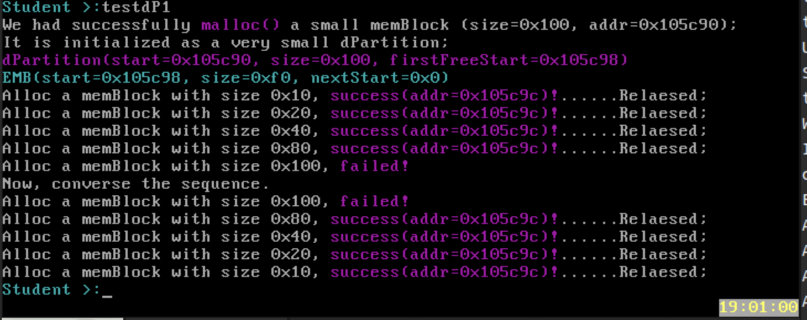

# lab4

PB21020552 张易

## 实验目标

本实验分别按顺序完成了内存检测算法,然后分别实现了dPartition,efPartition的内存分配方式.

## 源代码说明

### memTest

完成start的初始化,小于0x100000则等于0x100000,然后按照步长开始内存的的检查在头尾两字节均写入0xAA55以及0x55AA并读出进行检测.

### dPartition

#### dPartitionAllocFirstFit

初始化句柄,从第一个firstfreestart的emb块开始检测有无足够分配4+size的内存空间,有就分配且保存EMB的数据域,后移新增EMB数据结构,同时需要综合考虑是否需要修改firstfreestart,还是修改前一个EMB的指向

####  dPartitionFreeFirstFit

相对而言比较复杂的释放函数,需要找到前后的EMB块,依据数据域和前后的大小以及数据域判断时候需要合并还是建立链接的指针,同时需要判断是否需要修改handler的firstfree域

### efPartition

#### eFPartitionAlloc

分配第一个指向的域即可,同时移动句柄的指向

#### eFPartitionInit

初始化反而比分配函数重要,需要初始化同时链接上一个正确的链表

#### free

重新接上释放的域,同时完成新的EEB的初始化

### addNewCmd

维护一个ourcmds的链表,内部用malloc分配内存空间给newcmd,同时给newcmd等函数值进行拷贝,然后同链表的方式,采用头指针插入的方式进行维护.

### kmalloc与kfree

如图所示,同样的在pmeminit中创建新的句柄即可,同时在封装kmalloc中,用新分配的句柄作为封装函数即可.

## 思考题回答

### malloc接口实现

malloc函数通过调用了接口dPartitionAlloc(pMemHandler,size)函数,这个函数在dPartition.c中调用了dPartitionAllocFirstFit(dp,size);进行封装.而这个函数是自己实现的firstfit的算法,通过维护相关的数据结构进行实现

### memTestCaseInit

#### testdP1

从代码上来看,testdp1分配了一块0x100大小的内存空间,而在这里的实现方式是,EMB块的size域表明的是减去句柄,以及EMB块占用的内存,完全剩下的内存空间,也就是0xf0的大小,所以无法分配0x100的内存空间.同时其他的内存块都是分配一块,释放一块,可以发现分配的内存地址都是一致的,同时位置在EMB块地址的后4位(unsigned long的字节长度),这是因为需要保存EMB块的数据域.

#### testdP2

从testdP2的测试方式是,分配内存ABC,且均未越界,然后依次释放ABC,然后检查EMB块和句柄的空间,从截图上来看,在释放第一个A时,出现了两个EMB块,第一个emb块指向第二个,且句柄的firststart指向新释放的EMB块.释放了B的时候,可以发现还是有两个EMB块,且原先第一个EMB位置不变,size增大,这是因为两个分配的空间刚好相邻第一个start+size+sizeof(EMB)=刚释放的地址-sizeof(unsigned long),所以两者重合,进行合并.

释放c的时候,按照同样的方式,不过这个时候先合并之后的EMB块,然后判断发现,前面一个EMB块也可以同EMB块合并,所以最后只剩一下一个EMB块,同时这个EMB块与初始化的EMB块是一致的.

#### testdP3

与testdP2的测试大致一样,但是这个是从CBA的释放方式,可以看出,这个结构呈现上下对称的形式,符合预期.这是因为每次释放都能直接与后面的EMB块重叠,所以直接合并,在每一个时刻都只有一个EMB块.

#### maxMallocSizeNow

以步长为0x1000的方式测试最大能够分配的空间,其大小与pMemInit函数中的pMemHandler的初始化有关,大小同memtest函数算出的pMemSize有关

#### testeFP

在这个测试中创建大小为32(31按4字节对齐)字节的4个内存块,所以可以分配ABCD,4个内存块.同时EEB在分配的内存内,所以分配会摧毁EEB数据结构同时由于内存的释放方式采用的新释放的块指向之前句柄指向的块,句柄指向新的块,同时会恢复EEB块.

#### testMalloc1,testMalloc2

