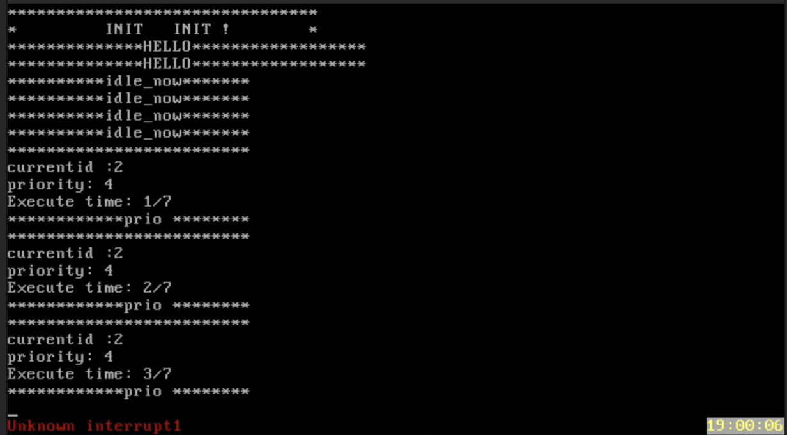

# lab6 调度算法

PB21020552 张易

## 实验结果说明

在提交实验代码时,默认选择优先级调度

### 优先级调度

如果想要采用优先级调度,请前往~/myOS/kernel/task.c 中修改 void TaskManagerInit(void)函数中的sche_sys.type = PRIO; (位于该程序的696行)
相关的任务自动初始化为优先级调度,同时把系统的调度设置成优先级调度

### RR时间片轮转调度

如果想要采用RR时间片轮转调度,请前往~/myOS/kernel/task.c 中修改 void TaskManagerInit(void)函数中的sche_sys.type = RR;  (位于该程序的696行)
相关的任务自动初始化为时间片调度,同时相关的任务定义在 ~/userApp/userTasks.c,同时系统的 ,可以选择不同的方式进行初始化,也就是可以选择任务arrive_time有相关的设置,或者一开始就放在调度队列中

## 实验结果

### 非抢占式prio实验结果说明

**可以参考doc文件录屏prio调度**

初始化了三个任务,第一个到达时间是4,优先级是4,执行时间7.第二个任务到达时间是5,优先级是3,执行时间是6,第三个任务的优先级是2,到达时间是7,执行时间是7.
所以任务执行顺序是:在前4s是idle状态,然后执行优先级是4的任务,这个执行完之后,由于后两个任务均到达,所以优先执行优先级是2的任务,然后执行优先级为3的任务.

idletsk显示是1s一次,信息显示也是一秒一次
如下图所示

### 抢占式时间片轮转调度

**可以参考doc文件中RR调度录屏**

设置的时间片是2s调度一次,由于可能切换的时延性,可能显示的时间略微有区别但是可以完成调度.

可以看到有点瑕疵,表现为最初不够稳定,连续调度了4s,之后开始顺利完成调度

图片如下所示:

